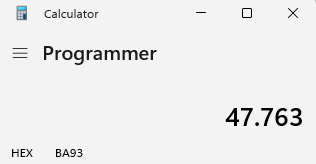
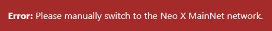

## Create a ViteJS React App Wallet Connect app for Neo X

## Intro
This tutorial will assume you have some knowlegde of React and ViteJS.
We will use https://docs.metamask.io/wallet/tutorials/react-dapp-global-state/ and the source is found on https://github.com/MetaMask/vite-react-global-tutorial as the starting point of our tutorial
Please ensure to go through that tutorial to understand the starting point.

## The improvement
In this tutorial we want to make sure that we are interacting with Neo X.
The original code does not take into account which network is being used.
I will guide you step by step how to implement changes to ensure the correct network is used.

## Step 1: Get the Neo X chain id (Hexadecimal)
First we need to retrieve the chain id from the resources. https://xdocs.ngd.network/development/development-environment-information
For Neo X the Mainnet chain id is 47763
Now open your calculator in programmer mode and convert it to Hexadecimal


Once we done that we know the chainid to use will be 0xba93


## Step 2: Setup variables
In WalletProvider.tsx we setup the variables like shown below.

```
  const REQUIRED_NETWORK = {
    chainId: '0xba93',
    networkName: 'Neo X MainNet', 
  };
```

## Step3: Introduce new code to switch the network
In order to set the correct network when selecting we will need to include a new method which we will call switch_network
```
  // In case of required network validation failure, trigger a network switch
  const switchNetwork = async (wallet: EIP6963ProviderDetail) => {
    try {
      await wallet.provider.request({
        method: 'wallet_switchEthereumChain',
        params: [{ chainId: REQUIRED_NETWORK.chainId }],
      });
      return true;
    } catch (error) {
      console.error('Failed to switch network:', error);
      setError(`Please manually switch to the ${REQUIRED_NETWORK.networkName} network.`);
      return false;
    }
  };
```

## Step 4: Update the connect method
Now that we have a method to make sure we are connecting to the correct network we need to modify the connect method.

specifically we want to add a check on the current chain and switch the network if it's not the desired network.
For this we will introduce this snippet:
```
      const chainId = await wallet.provider.request({ method: 'eth_chainId' });
  
      // Check if the wallet is on the required network
      if (chainId !== REQUIRED_NETWORK.chainId) {
        switchNetwork(wallet);
      }
```

That will make the final code look like this.
```
  const connectWallet = useCallback(async (walletRdns: string) => {
    try {
      const wallet = wallets[walletRdns];
      
      const chainId = await wallet.provider.request({ method: 'eth_chainId' });
  
      // Check if the wallet is on the required network
      if (chainId !== REQUIRED_NETWORK.chainId) {
        switchNetwork(wallet);
      }

      const accounts = await wallet.provider.request({ method: 'eth_requestAccounts' }) as string[];
  
      if (accounts?.[0]) {
        setSelectedWalletRdns(wallet.info.rdns);
        setSelectedAccountByWalletRdns((currentAccounts) => ({
          ...currentAccounts,
          [wallet.info.rdns]: accounts[0],
        }));
  
        localStorage.setItem('selectedWalletRdns', wallet.info.rdns);
        localStorage.setItem('selectedAccountByWalletRdns', JSON.stringify({
          ...selectedAccountByWalletRdns,
          [wallet.info.rdns]: accounts[0],
        }));
      }
    } catch (error) {
      console.error('Failed to connect to provider:', error);
      const walletError: WalletError = error as WalletError;
      setError(`Code: ${walletError.code} \nError Message: ${walletError.message}`);
    }
  }, [wallets, selectedAccountByWalletRdns]);
  
```
Rest assured if the network switch doesn't work the user is notified, details can be added to explain how to add the network.


## Conclusion
Congratulations you successfully managed to create a vitejs + react website that connects to the Neo X Network specifically.
We've taken the following steps:

- Get the chain information
- Write a method to switch the network
- Implement connect logic that verifies the network

Enhancements:

- Get the chainid and name from enviroment file.
- Improve information to the user how to switch or add the network.

Now you're fully equiped to apply the skills from this tutorial to build out your own custom dApp project! As always if you have
any questions don't hesitate to reach out on the [NeoX Discord server](https://discord.gg/neosmarteconomy).